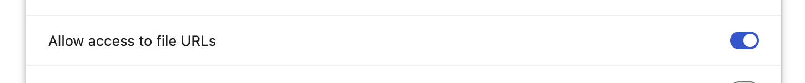

some tampermonkey scripts

### Setup

- Set access to file URLs




- Copy headers from scripts

```js
// ==UserScript==
// @name         youtube helpers
// @namespace    http://tampermonkey.net/
// @match        https://www.youtube.com/*
// @icon         https://www.google.com/s2/favicons?sz=64&domain=youtube.com
// @grant        none
// @require      file:///Users/justin/Code/tamper-scripts/youtube-helpers.js
// ==/UserScript==
```
